# Prometheus For Developers

This is a gentle introduction I created for telling the software developers
in my [company](https://descomplica.com.br) the basics about
[Prometheus](https://prometheus.io).

If you have any suggestion to improve this content, don't hesitate to contact
me. Pull Requests are welcome!

## Table of Contents

- [Workshop Project](#workshop-project)
  - [Pre-Requisites](#pre-requisites)
  - [Running the Code](#running-the-code)
  - [Cleaning Up](#cleaning-up)
- [Prometheus Overview](#prometheus-overview)
  - [Push vs Pull](#push-vs-pull)
    - [Metrics Endpoint](#metrics-endpoint)
  - [Time Series and Data Points](#time-series-and-data-points)
  - [Duplicate Metrics Names?](#duplicate-metrics-names)
  - [Monitoring Uptime](#monitoring-uptime)
    - [A Basic Uptime Alert](#a-basic-uptime-alert)
- [Instrumenting Your Applications](#instrumenting-your-applications)
  - [Measuring Request Durations](#measuring-request-durations)
    - [Quantile Estimation Errors](#quantile-estimation-errors)
  - [Measuring Throughput](#measuring-throughput)
  - [Measuring Memory/CPU Usage](#measuring-memorycpu-usage)
  - [Monitoring Applications Without a Metrics Endpoint](#monitoring-applications-without-a-metrics-endpoint)
  - [Final Gotchas](#final-gotchas)
- [References](#references)

## Workshop Project

This workshop follows a more practical approach (with hopefully just the
right amount of theory!), so we provide a simple Docker Compose configuration
for simplifying the project bootstrap.

### Pre-Requisites

- Docker + Docker Compose

### Running the Code

Run the following command to start everything up:

```bash
$ docker-compose up -d
```

- Alertmanager: <http://localhost:9093>
- Grafana: <http://localhost:3000> (user/password: `admin`)
- Prometheus: <http://localhost:9090>
- Sample Node.js Application: <http://localhost:4000>

### Cleaning Up

Run the following command to stop all running containers from this project:

```bash
$ docker-compose rm -fs
```

## Prometheus Overview

Prometheus is an open source monitoring and time-series database (TSDB)
designed after
[Borgmon](https://landing.google.com/sre/book/chapters/practical-alerting.html),
the monitoring tool created internally at Google for collecting metrics
from jobs running in their cluster orchestration platform,
[Borg](https://ai.google/research/pubs/pub43438).

The following image shows an overview of the Prometheus architecture.


In the center we have a **Prometheus server**, which is the component
responsible for periodically collecting and storing metrics from various
 **targets** (e.g. the services you want to collect metrics from).

The list of **targets** can be statically defined in the Prometheus
configuration file, or we can use other means to automatically discover
those targets via **Service discovery**. For instance, if you want to monitor
a service that's deployed in EC2 instances in AWS, you can configure Prometheus
to use the AWS EC2 API to discover which instances are running a particular
service and then _scrape_ metrics from those servers; this is preferred over
statically listing the IP addresses for our application in the Prometheus
configuration file, which will eventually get out of sync, especially in a
dynamic environment such as a public cloud provider.

Prometheus also provides a basic **Web UI** for running queries on the stored
data, as well as integrations with popular visualization tools, such as
[Grafana](https://grafana.net).

### Push vs Pull

Previously, we mentioned that the **Prometheus server** _scrapes_ (or pulls)
metrics from our **target** applications.

This means Prometheus took a different approach than other "traditional"
monitoring tools, such as [StatsD](https://github.com/etsy/statsd), in
which applications _push_ metrics to the metrics server or aggregator, 
instead of having the metrics server _pulling_ metrics from applications.

The consequence of this design is a better separation of concerns; when
the application pushes metrics to a metrics server or aggregator, it has
to make decisions like: where to push the metrics to; how often to push the
metrics; should the application aggregate/consolidate any metrics before
pushing them; among other things.

In _pull-based_ monitoring systems like Prometheus, these decisions go
away; for instance, we no longer have to re-deploy our applications if we want
to change the metrics resolution (how many data points collected per minute) or
the monitoring server endpoint (we can architect the monitoring system in a
way completely transparent to application developers).

---

**Want to know more?** The Prometheus documentation provides a
[comparison](https://prometheus.io/docs/introduction/comparison/) with
other tools in the monitoring space regarding scope, data model, and storage.

---

Now, if the application doesn't push metrics to the metrics server, how does
the applications metrics end up in Prometheus?

#### Metrics Endpoint

Applications expose metrics to Prometheus via a _metrics endpoint_. To see how
this works, let's start everything by running `docker-compose up -d` if you
haven't already.

Visit <http://localhost:3000> to open Grafana and log in with the default
`admin` user and password. Then, click on the top link "Home" and select the
"Prometheus 2.0 Stats" dashboard.

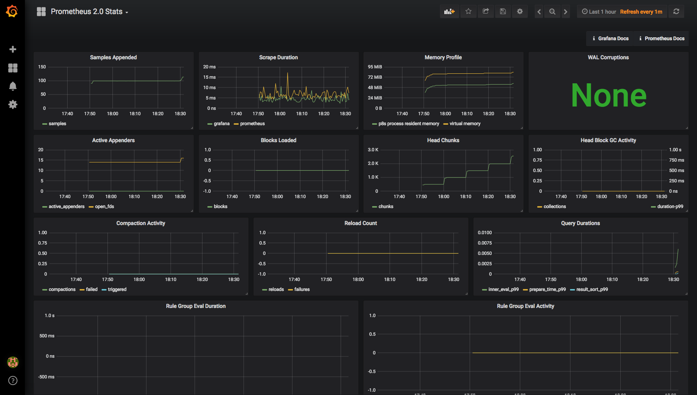

Yes, Prometheus is _scraping_ metrics from itself!

Let's pause for a moment to understand what happened. First, Grafana is already
configured with a
[Prometheus data source](http://docs.grafana.org/features/datasources/prometheus/)
that points to the local Prometheus server. This is how Grafana is able to
display data from Prometheus. Also, if you look at the Prometheus configuration
file, you can see that we listed Prometheus itself as a target.

```yaml
# config/prometheus/prometheus.yml

# Simple scrape configuration for each service
scrape_configs:
  - job_name: prometheus
    static_configs:
      - targets: ['localhost:9090']
```

By default, Prometheus gets metrics via the `/metrics` endpoint in each target,
so if you hit <http://prometheus:9090/metrics>, you should see something like
this:

```
# HELP go_gc_duration_seconds A summary of the GC invocation durations.
# TYPE go_gc_duration_seconds summary
go_gc_duration_seconds{quantile="0"} 5.95e-05
go_gc_duration_seconds{quantile="0.25"} 0.0001589
go_gc_duration_seconds{quantile="0.5"} 0.0002188
go_gc_duration_seconds{quantile="0.75"} 0.0004158
go_gc_duration_seconds{quantile="1"} 0.0090565
go_gc_duration_seconds_sum 0.0331214
go_gc_duration_seconds_count 47
# HELP go_goroutines Number of goroutines that currently exist.
# TYPE go_goroutines gauge
go_goroutines 39
# HELP go_info Information about the Go environment.
# TYPE go_info gauge
go_info{version="go1.10.3"} 1
# HELP go_memstats_alloc_bytes Number of bytes allocated and still in use.
# TYPE go_memstats_alloc_bytes gauge
go_memstats_alloc_bytes 3.7429992e+07
# HELP go_memstats_alloc_bytes_total Total number of bytes allocated, even if freed.
# TYPE go_memstats_alloc_bytes_total counter
go_memstats_alloc_bytes_total 1.37005104e+08
...
```

In this snippet alone we can notice a few interesting things:

1. Each metric has a user friendly description that explains its purpose
2. Each metric may define additional dimensions, also known as **labels**. For
   instance, the metric `go_info` has a `version` label
   - Every time series is uniquely identified by its metric name and the set of 
     label-value pairs
3. Each metric is defined as a specific type, such as `summary`, `gauge`,
   `counter`, and `histogram`. More information on each data type can be found
   [here](https://prometheus.io/docs/concepts/metric_types/)

But how does this text-based response turns into data points in a time series
database?

### Time Series and Data Points

The best way to understand this is by running a few simple queries.

Open the Prometheus UI at <http://localhost:9090/graph>, type
`process_resident_memory_bytes` in the text field and hit _Execute_.

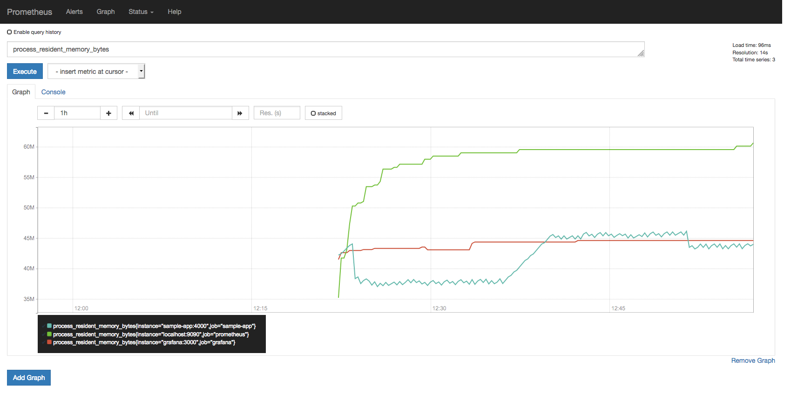

You can use the graph controls to zoom into a specific region.

This first query is very simple as it only plots the value of the
`process_resident_memory_bytes` gauge as time passes, and as you might
have guessed, that query displays the resident memory usage for each target,
in bytes.

Since our setup uses a 5-second scrape interval, Prometheus will hit the
`/metrics` endpoint of our targets every 5 seconds to fetch the current
metrics and store those data points sequentially, indexed by timestamp.

```yaml
# In prometheus.yml
global:
  scrape_interval: 5s
```

You can see the all samples from that metric in the past minute by querying
`process_resident_memory_bytes{job="grafana"}[1m]` (select _Console_ in the
Prometheus UI):

| Element | Value |
|---------|-------|
| process_resident_memory_bytes{instance="grafana:3000",job="grafana"} | 40861696@1530461477.446 43298816@1530461482.447 43778048@1530461487.451 44785664@1530461492.447 44785664@1530461497.447 45043712@1530461502.448 45043712@1530461507.448 45301760@1530461512.451 45301760@1530461517.448 45301760@1530461522.448 45895680@1530461527.448 45895680@1530461532.447 |

### Duplicate Metrics Names?

If you inspect the contents of the `/metrics` endpoint at all our targets,
you'll see that multiple targets export metrics under the same name.

But isn't this a problem? If we are exporting metrics under the same name,
how can we be sure we are not mixing metrics between different applications
into the same time series data?

Consider the previous metric, `process_resident_memory_bytes`: Grafana,
Prometheus, and our sample application all export a gauge metric under the
same name. However, did you notice in the previous plot that somehow we were
able to get a separate time series from each application?

Quoting the [documentation](https://prometheus.io/docs/concepts/jobs_instances/):

> In Prometheus terms, an endpoint you can scrape is called an **instance**,
> usually corresponding to a single process. A collection of instances with
> the same purpose, a process replicated for scalability or reliability for
> example, is called a **job**.
>
> When Prometheus scrapes a target, it attaches some labels automatically to 
> the scraped time series which serve to identify the scraped target:
> -  `job` - The configured job name that the target belongs to.
> - `instance` - The `<host>:<port>` part of the target's URL that was scraped.

Since our configuration has three different targets (with one instance each)
exposing this metric, we can see three lines in that plot.

### Monitoring Uptime

For each instance scrape, Prometheus stores a `up` metric with the value `1` when
the instance is healthy, i.e. reachable, or `0` if the scrape failed.

Try plotting the query `up` in the Prometheus UI.

If you followed every instruction up until this point, you'll notice that
so far all targets were reachable at all times.

Let's change that. Run `docker-compose stop sample-app` and after a few
seconds you should see the `up` metric reporting our sample application
is down.

Now run `docker-compose restart sample-app` and the `up` metric should
report the application is back up again.

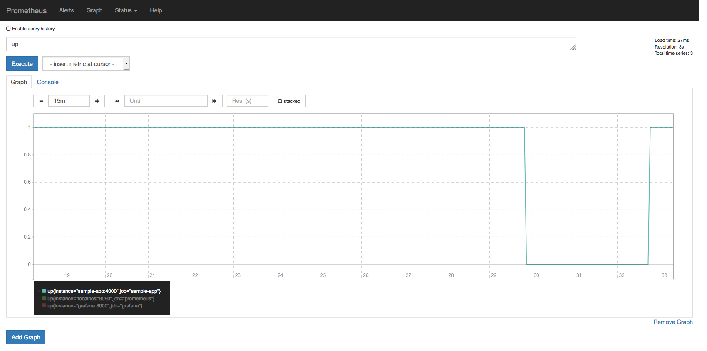

---

**Want to know more?** The Prometheus query UI provides a combo box with all
available metric names registered in its database. Do some exploring, try
querying different ones. For instance, can you plot the file descriptor
handles usage (in %) for all targets? **Tip:** the metric names end with
`_fds`.

---

##### A Basic Uptime Alert

We don't want to keep staring at dashboards in a big TV screen all day
to be able to quickly detect issues in our applications, afterall, we have
better things to do with our time, right?

Luckily, Prometheus provides a facility for defining alerting rules that,
when triggered, will notify
[Alertmanager](https://prometheus.io/docs/alerting/alertmanager/), which is
the component that takes care of deduplicating, grouping, and routing them
to the correct receiver integration (i.e. email, Slack, PagerDuty,
OpsGenie). It also takes care of silencing and inhibition of alerts.

Configuring Alertmanager to send metrics to PagerDuty, or Slack, or whatever,
is out of the scope of this workshop, but we can still play around with alerts.

Let's define our first alerting rule in `config/prometheus/prometheus.rules.yml`:

```yaml
# Uptime alerting rule
groups:
- name: uptime
  rules:
  - alert: ServerDown
    expr: up == 0
    for: 1m
    labels:
      severity: page
    annotations:
      summary: One or more targets are down
      description: Instance {{ $labels.instance }} of {{ $labels.job }} is down
```

Restart Prometheus with `docker-compose restart prometheus` and open the Alerts
page at <http://localhost:9090/alerts>.

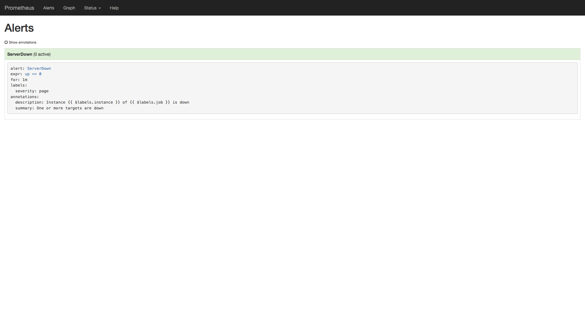

Each alerting rule in Prometheus is also a time series, so in this case you can
query `ALERTS{alertname="ServerDown"}` to see the state of that alert at any
point in time; this metric will not return any data points now because so far
no alerts have been triggered.

Let's change that. Run `docker-compose stop grafana` to kill Grafana. After a
few seconds you should see the `ServerDown` alert transition to a yellow state,
or `PENDING`.

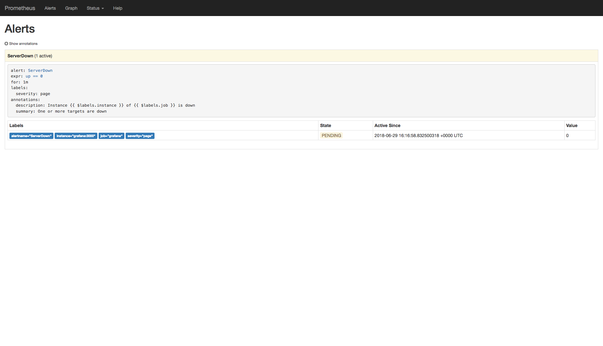

The alert will stay as `PENDING` for one minute, which is the threshold we
configured in our alerting rule. After that, the alert will transition to a red
state, or `FIRING`.

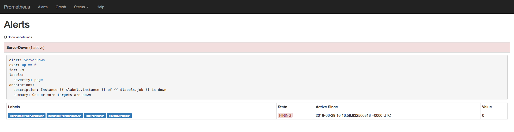

After that point, the alert will show up in Alertmanager. Visit
<http://localhost:9093> to open the Alertmanager UI.

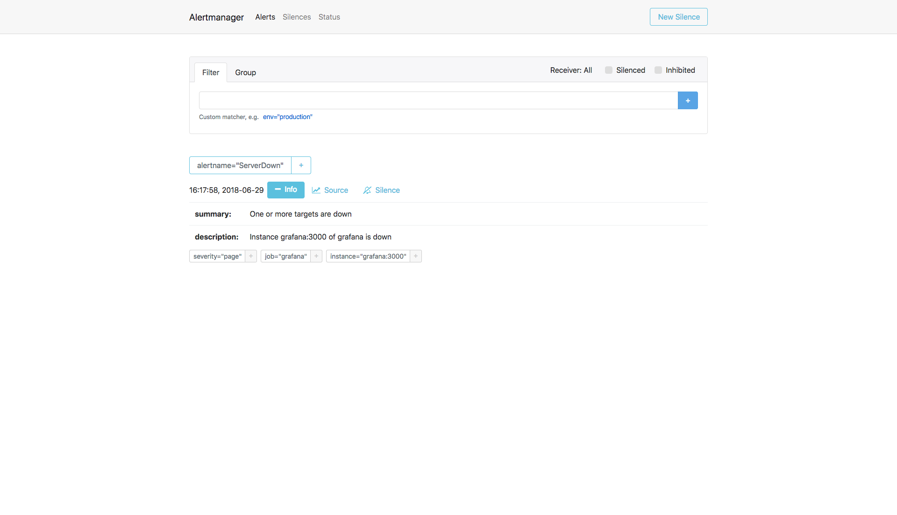

Let's restore Grafana. Run `docker-compose restart grafana` and the alert
should go back to a green state after a few seconds.

## Instrumenting Your Applications

Let's examine a sample Node.js application we created for this workshop.

Open the `./sample-app/index.js` file in your favorite text editor. The
code is fully commented, so you should not have a hard time understading
it.

### Measuring Request Durations

We can measure request durations with
[percentiles](https://en.wikipedia.org/wiki/Quantile) or
[averages](https://en.wikipedia.org/wiki/Arithmetic_mean). However,
it's not recommended relying on averages to track request durations because
averages can be very misleading (see the [References](#references) for a few posts on the pitfalls of averages and how percentiles can help).

In Prometheus, we can generate percentiles with summaries or histograms.

To show the differences between these two, our sample application exposes
two custom metrics for measuring request durations with:

```js
// Summary metric for measuring request durations
const requestDurationSummary = new prometheusClient.Summary({
    // Metric name
    name: 'sample_app_summary_request_duration_seconds',

    // Metric description
    help: 'Summary of request durations',

    // Extra dimensions, or labels
    // HTTP method (GET, POST, etc), and status code (200, 500, etc)
    labelNames: ['method', 'statuscode'],

    // 50th (median), 75th, 90th, 95th, and 99th percentiles
    percentiles: [0.5, 0.75, 0.9, 0,95, 0.99]
});

// Histogram metric for measuring request durations
const requestDurationHistogram = new prometheusClient.Histogram({
    // Metric name
    name: 'sample_app_histogram_request_duration_seconds',

    // Metric description
    help: 'Histogram of request durations',

    // Extra dimensions, or labels
    // HTTP method (GET, POST, etc), and status code (200, 500, etc)
    labelNames: ['method', 'statuscode'],

    // Duration buckets, in seconds
    // 5ms, 10ms, 25ms, 50ms, 100ms, 250ms, 500ms, 1s, 2.5s, 5s, 10s
    buckets: [0.005, 0.01, 0.025, 0.05, 0.1, 0.25, 0.5, 1, 2.5, 5, 10]
});
```

As you can see, in a summary we specify the percentiles in which we
want the Prometheus client to calculate and report latencies, while in a
histogram we specify the buckets where the observed durations will be
classified (i.e. a 300ms duration will be stored in the 250ms-500ms
bucket).

Our sample application introduces a one-second delay in approximately 5%
of requests, just so we can compare the average response time with
99th percentiles:

```js
// Main route
app.get('/', async (req, res) => {
    // Simulate a 1s delay in ~5% of all requests
    if (Math.random() <= 0.05) {
        const sleep = (ms) => {
            return new Promise((resolve) => {
                setTimeout(resolve, ms);
            });
        };
        await sleep(1000);
    }
    res.send('Hello, world!');
});
```

Let's put some load on this server to generate some metrics for us to play
with:

```bash
$ docker run --rm -it --net host williamyeh/wrk -c 4 -t 2 -d 900  http://localhost:4000
Running 15m test @ http://localhost:4000
  2 threads and 4 connections
  Thread Stats   Avg      Stdev     Max   +/- Stdev
    Latency   269.03ms  334.46ms   1.20s    78.31%
    Req/Sec    85.61    135.58     1.28k    89.33%
  72170 requests in 15.00m, 14.94MB read
Requests/sec:     80.18
Transfer/sec:     16.99KB
```

Now run the following queries in the Prometheus UI:

```bash
# Average response time
rate(sample_app_summary_request_duration_seconds_sum[15s]) / rate(sample_app_summary_request_duration_seconds_count[15s])

# 99th percentile (via summary)
sample_app_summary_request_duration_seconds{quantile="0.99"}

# 99th percentile (via histogram)
histogram_quantile(0.99, sum(rate(sample_app_histogram_request_duration_seconds_bucket[15s])) by (le, method, statuscode))
```

The result of these queries may seem surprising.

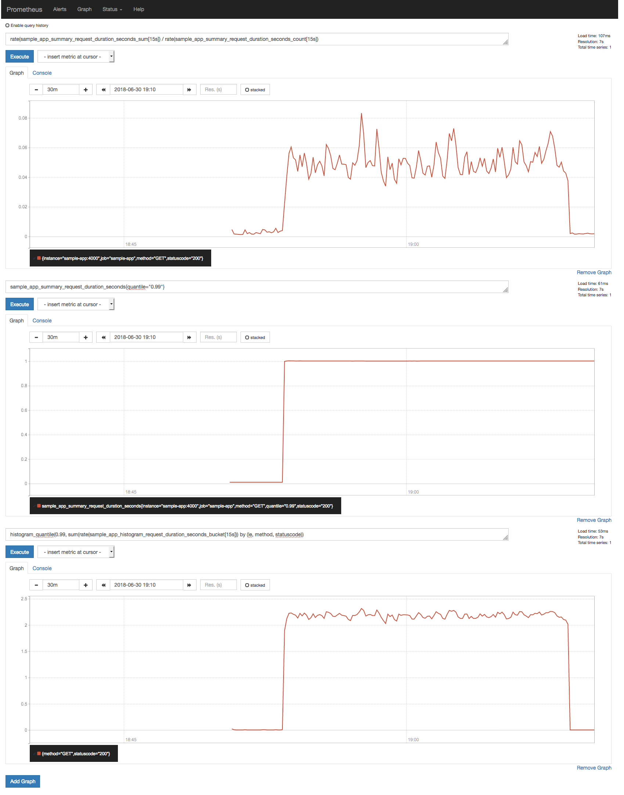

The first thing to notice is how the average response time fails to
communicate the actual behavior of the response duration distribution
(avg: 50ms; p99: 1s); the second is how the 99th percentile reported by the
the summary (1s) is quite different than the one estimated by the `histogram_quantile()` function (~2.2s). How can this be?

#### Quantile Estimation Errors

Quoting the [documentation]():

> You can use both summaries and histograms to calculate so-called
> φ-quantiles, where 0 ≤ φ ≤ 1. The φ-quantile is the observation value
> that ranks at number φ*N among the N observations. Examples for
> φ-quantiles: The 0.5-quantile is known as the median. The
> 0.95-quantile is the 95th percentile.
>
> The essential difference between summaries and histograms is that
> summaries calculate streaming φ-quantiles on the client side and
> expose them directly, while histograms expose bucketed observation
> counts and the calculation of quantiles from the buckets of a
> histogram happens on the server side using the
> `histogram_quantile()` function.

In other words, for the quantile estimation from the buckets of a
histogram to be accurate, we need to be careful when picking the bucket
layout; if it doesn't match the range and distribution of the actual
observed durations, you will get inaccurate quantiles as a result.

Remembering our current histogram configuration:

```js
// Histogram metric for measuring request durations
const requestDurationHistogram = new prometheusClient.Histogram({
    // Metric name
    name: 'sample_app_histogram_request_duration_seconds',

    // Metric description
    help: 'Histogram of request durations',

    // Extra dimensions, or labels
    // HTTP method (GET, POST, etc), and status code (200, 500, etc)
    labelNames: ['method', 'statuscode'],

    // Duration buckets, in seconds
    // 5ms, 10ms, 25ms, 50ms, 100ms, 250ms, 500ms, 1s, 2.5s, 5s, 10s
    buckets: [0.005, 0.01, 0.025, 0.05, 0.1, 0.25, 0.5, 1, 2.5, 5, 10]
});
```

Here we are using a _exponential_ bucket configuration in which the buckets
get larger as latency gets bigger. This is a widely used pattern; since we
always expect our services to respond quickly (i.e. with response time
between 0 and 300ms), we specify more buckets for that range, and fewer
buckets for request durations we think are less likely to occur.

According to the previous plot, all slow requests from our application
is falling into the 1s-2.5s bucket, causing us to lose precision when
calculating the 99th percentile.

Since we know our application will take at most ~1s to respond, we can
choose a more appropriate bucket layout:

```js
// Histogram metric for measuring request durations
const requestDurationHistogram = new prometheusClient.Histogram({
    // ...

    // Experimenting a different bucket layout
    buckets: [0.005, 0.01, 0.02, 0.05, 0.1, 0.25, 0.5, 0.8, 1, 1.2, 1.5]
```

Let's start a clean Prometheus server with the modified bucket configuration
to see if the quantile estimation improves:

```bash
$ docker-compose rm -fs
$ docker-compose build sample-app
$ docker-compose up -d
```

If you re-run the load test, now you should get something like this:

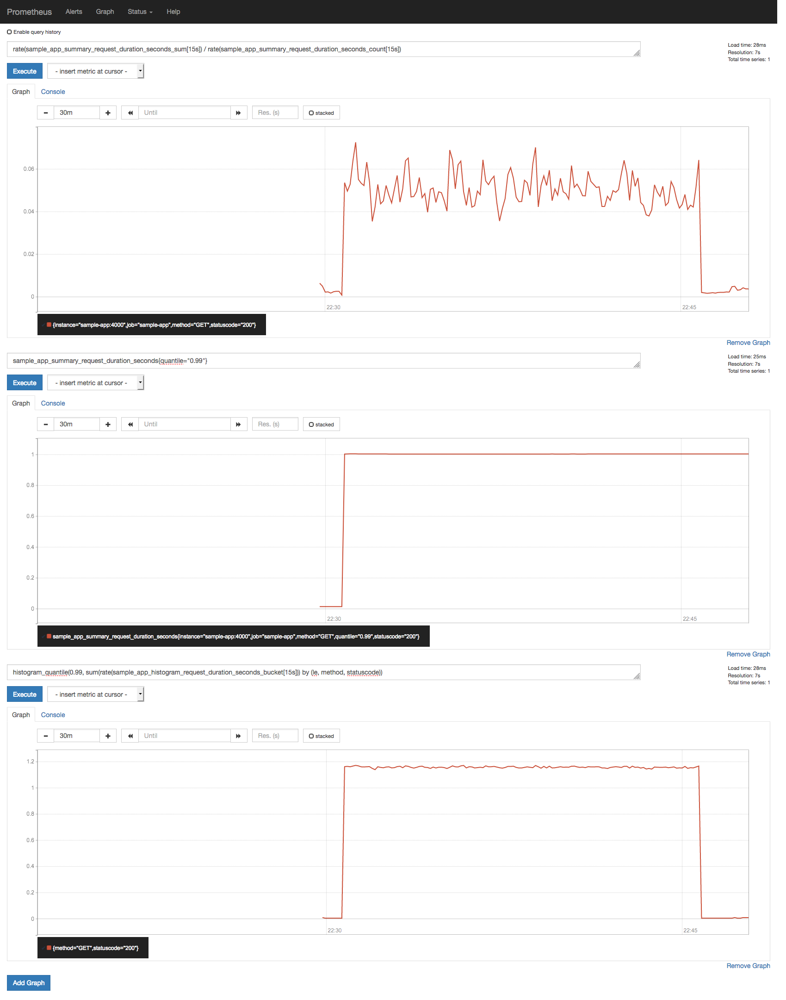

Not quite there, but it's an improvement!

---

**Want to know more?** If all it takes for us to achieve high accuracy
histogram data is to use more buckets, why not use a large number of small
buckets?

The reason is efficiency. Remember:

**more buckets == more labels == more time series == more space == slower
queries**

Let's say you have an SLA to serve 99% of requests within 300ms. If all
you want to know is whether you are honoring your SLA or not, it doesn't
really matter if the quantile estimation is not accurate for requests
slower than 300ms.

You might also be wondering: if summaries are more precise, why not using
summaries instead of histograms?

Quoting the [documentation](https://prometheus.io/docs/practices/histograms/#errors-of-quantile-estimation):

> A summary would have had no problem calculating the correct percentile
> value in most cases. Unfortunately, we cannot use a summary if we need
> to aggregate the observations from a number of instances.

Histograms are more versatile in this regard. If you have an application
with multiple replicas, you can safely use the `histogram_quantile()`
function to calculate the 99th percentile across all requests to all
replicas. You cannot do this with summaries. I mean, you can `avg()` the
99th percentiles of all replicas, or take the `max()`, but the value you
will get will be statistically incorrect.

---

### Measuring Throughput

If you are using a histogram to measure request duration, you can use
the `_count` timeseries to measure throughput without having to introduce
another metric.

For instance, if your histogram metric name is
`sample_app_histogram_request_duration_seconds`, then you can use the
`sample_app_histogram_request_duration_seconds_count` metric to measure
throughput:

```bash
# Number of requests per second (data from the past 30s)
rate(sample_app_histogram_request_duration_seconds_count[30s])
```

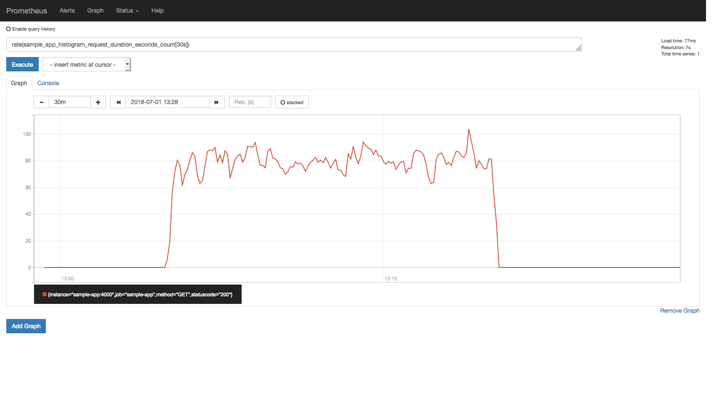

### Measuring Memory/CPU Usage

Most Prometheus clients already provide a default set of metrics;
[prom-client](https://github.com/siimon/prom-client), the Prometheus
client for Node.js, does this as well.

Try these queries in the Prometheus UI:

```bash
# Gauge that provides the current memory usage, in bytes
process_resident_memory_bytes

# Gauge that provides the usage in CPU seconds per second
rate(process_cpu_seconds_total[30s])
```

If you use `wrk` to put some load into our sample application, you might see
something like this:

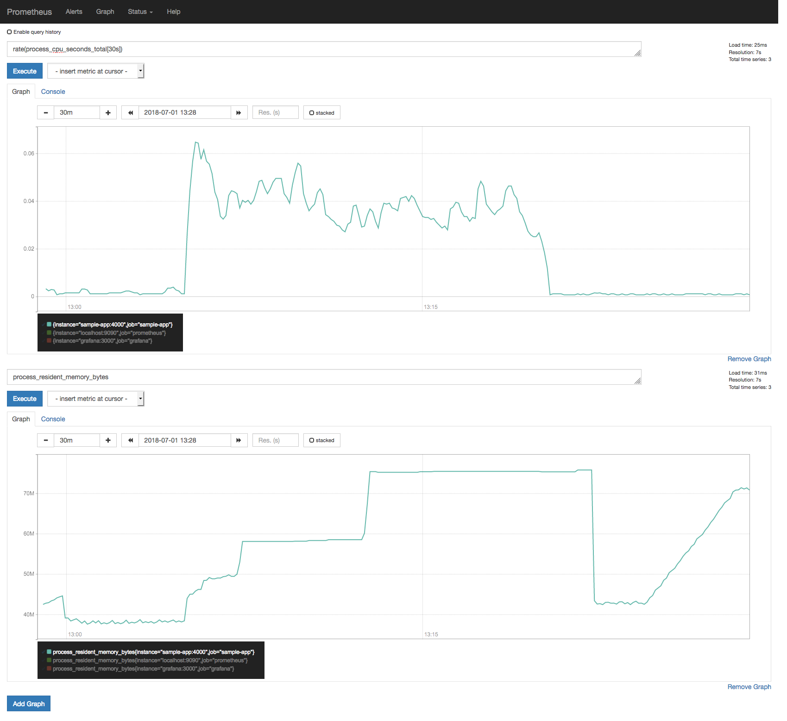

If you run `docker stats` at the same time as the load test, you should
see the metrics match the data provided by Docker.

---

**Want to know more?** Our sample application exports different metrics
to expose some internal Node.js information, such as GC runs, heap usage
by type, event loop lag, and current active handles/requests. Plot those
metrics in the Prometheus UI, and see how they behave when you apply
some load to the application.

A sample dashboard containing all those metrics is also available in our
Grafana server at <http://localhost:3000>.

---

### Monitoring Applications Without a Metrics Endpoint

We learned that Prometheus needs all applications to expose a `/metrics`
HTTP endpoint for it to scrape metrics. But what if you want to monitor
a MySQL instance, which does not provide a Prometheus metrics endpoint?
What can we do?

That's where _exporters_ come in. The
[documentation](https://prometheus.io/docs/instrumenting/exporters/) lists a
comprehensive list of official and third-party exporters for a variety of
systems, such as databases, messaging systems, cloud providers, and so forth.

For a very simplistic example, check out the
[aws-limits-exporter](https://github.com/danielfm/aws-limits-exporter) 
project, which is about 200 lines of Go code.

### Final Gotchas

The Prometheus documentation page on
[instrumentation](https://prometheus.io/docs/practices/instrumentation/)
does a pretty good job in laying out some of the things to watch out
for when instrumenting your applications.

Also, beware that there are
[conventions](https://prometheus.io/docs/practices/naming/) on what makes
a good metric name; poorly (or wrongly) named metrics will cause you a
hard time when creating queries later.

## References

- <https://prometheus.io/docs/>
- <https://www.robustperception.io/understanding-machine-cpu-usage/>
- <http://latencytipoftheday.blogspot.com/2014/06/latencytipoftheday-you-cant-average.html>
- <https://www.dynatrace.com/news/blog/why-averages-suck-and-percentiles-are-great/>
- <https://github.com/siimon/prom-client>